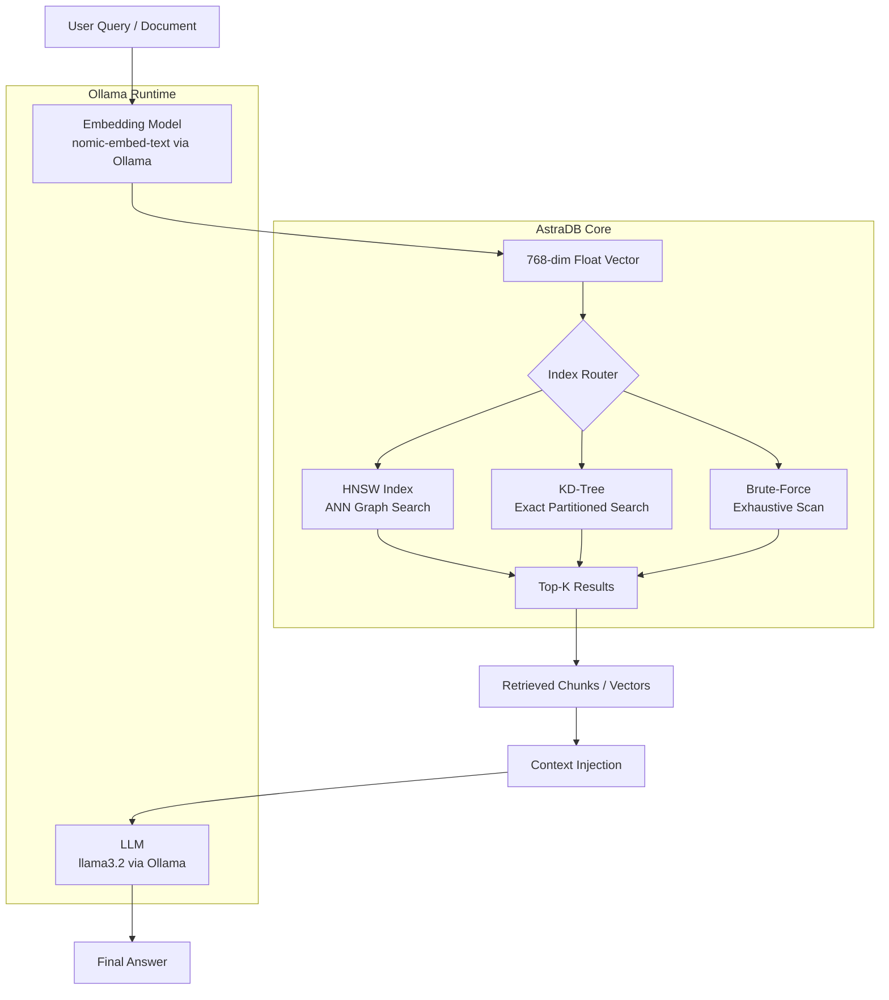

# AstraDB

**High-Performance Vector Search Engine for AI Retrieval Systems**

AstraDB is a vector database engine built from scratch in C++17. It implements HNSW, KD-Tree, and brute-force ANN search alongside a full RAG pipeline, REST API, and PCA visualization layer. The project demonstrates how modern AI retrieval systems operate internally — from embedding ingestion to approximate nearest-neighbor traversal to context-augmented language model generation.

---


---

```
[ Architecture Preview ]
src/
├── hnsw/           HNSW multilayer graph index
├── kdtree/         KD-Tree spatial partitioning
├── bruteforce/     Exact exhaustive search
├── embeddings/     Ollama embedding client
├── rag/            Retrieval-augmented generation pipeline
├── api/            HTTP REST server (cpp-httplib)
├── visualization/  PCA dimensionality reduction + plotting
└── utils/          Vector math, distance metrics, logging
```

> Architecture diagram and benchmark charts: see `/docs/architecture.png` and `/docs/benchmarks.png`

---

## What AstraDB Is

AstraDB is a purpose-built vector search engine that indexes high-dimensional floating-point vectors and retrieves the most semantically similar ones under latency constraints. It is not a wrapper around a third-party library. Every indexing algorithm is implemented from first principles in C++17.

**Why vector databases matter.** Neural embedding models encode text, images, and structured data into dense vector spaces where geometric proximity correlates with semantic similarity. Querying these spaces by distance rather than exact key lookup is the foundation of modern semantic search, recommendation systems, and retrieval-augmented generation.

**Why ANN search matters.** Exact nearest-neighbor search over 1M+ vectors at 768 dimensions is computationally intractable for interactive workloads. Approximate nearest-neighbor (ANN) algorithms trade a bounded recall loss for orders-of-magnitude latency reduction. HNSW is the current state-of-the-art ANN index for in-memory retrieval, achieving sub-millisecond query times at recall rates above 95%.

---

## Key Features

| Feature | Description | Algorithm |
|---|---|---|
| HNSW Indexing | Multilayer navigable small world graph for sub-logarithmic ANN search | Graph-based ANN |
| KD-Tree Search | Recursive binary space partitioning for exact low-dimensional search | Tree-based exact |
| Brute-Force Search | Exhaustive cosine/L2 similarity scan for correctness baseline | O(N * d) |
| RAG Pipeline | End-to-end retrieval-augmented generation with Ollama LLM integration | Semantic retrieval |
| PCA Visualization | Dimensionality reduction for 2D/3D vector-space visualization | PCA (SVD-based) |
| REST API | HTTP endpoints for insert, search, benchmark, and RAG queries | cpp-httplib |
| Semantic Retrieval | Embedding-driven top-K chunk retrieval with context injection | Cosine similarity |
| Benchmarking | Latency, recall, and memory profiling across all three algorithms | Comparative |

---

## System Architecture



**Full retrieval pipeline:**

```
Raw Text
  → Ollama (nomic-embed-text)
  → 768-dim dense vector
  → HNSW graph insertion / ANN query
  → Top-K nearest neighbors (by cosine distance)
  → Retrieved document chunks
  → Context window assembly
  → Ollama (llama3.2) generation
  → Grounded natural language answer
```

---

## How HNSW Works

Hierarchical Navigable Small World (HNSW) constructs a multi-layer proximity graph where each layer is a navigable small world graph. Higher layers contain fewer nodes with long-range connections; lower layers contain all nodes with short-range connections.

### Layer Structure

```
Layer 2:  o --------- o                  (sparse, long edges)
               \     /
Layer 1:  o -- o -- o -- o               (medium density)
          |    |    |    |
Layer 0:  o-o-o-o-o-o-o-o-o-o-o-o       (all nodes, dense)
```

### Insertion

When inserting a vector:

1. Assign a random maximum layer `l_max = floor(-ln(uniform(0,1)) * mL)` where `mL = 1/ln(M)`.
2. Starting from the entry point at the top layer, greedily descend to `l_max`.
3. At each layer from `l_max` down to 0, run a greedy beam search with beam width `ef_construction` to find the `M` closest neighbors.
4. Bidirectionally connect the new node to its `M` neighbors at each layer.
5. Prune connections exceeding `M` using heuristic neighbor selection.

### Query

1. Start at the single global entry point at the top layer.
2. Greedily traverse to the closest node at each layer.
3. At layer 0, run a priority-queue beam search with beam width `ef_search`.
4. Return the top-K closest nodes from the candidate set.

### Complexity

| Operation | Time Complexity |
|---|---|
| Insert | O(log N) amortized |
| Query (ANN) | O(log N) |
| Memory | O(N * M * layers) |

**Parameters:**

- `M` (12-64): edges per node. Higher M = better recall, higher memory, slower insert.
- `ef_construction` (100-500): beam width during build. Higher = better graph quality, slower build.
- `ef_search` (50-200): beam width during query. Higher = better recall, higher latency. Tune per recall target.

**vs. Brute-Force:**

```
Brute-Force:  O(N * d)  — exact, no index overhead, scales linearly
HNSW:         O(log N)  — approximate, bounded recall loss, scales logarithmically
```

At N=1M, d=768, HNSW queries in ~1-5ms. Brute-force queries in ~800ms-2s. Recall delta is typically 2-5% at ef_search=100.

---

## KD-Tree Explanation

A KD-Tree recursively partitions a d-dimensional vector space by splitting at the median along the highest-variance axis at each depth level.

```
Depth 0: Split on dimension 0 (x-axis)
Depth 1: Split on dimension 1 (y-axis)
Depth 2: Split on dimension 0 (x-axis)
...
```

### Exact Nearest-Neighbor Search

1. Traverse the tree to the leaf node closest to the query vector.
2. Unwind the recursion, pruning branches whose minimum possible distance exceeds the current best.
3. The pruning criterion: `distance(query, splitting_hyperplane) >= current_best_distance` → prune.

### Complexity

| Operation | Time Complexity |
|---|---|
| Build | O(N log N) |
| Query (low-d) | O(log N) average |
| Query (high-d) | O(N) worst case |

### Curse of Dimensionality

KD-Tree performance degrades sharply above ~20 dimensions. In high-dimensional space, the distance from a query to a hyperplane approaches the distance to any individual point. The pruning condition is almost never satisfied, causing near-exhaustive traversal. At d=768, KD-Tree query time approaches O(N) and provides no practical advantage over brute-force.

AstraDB includes KD-Tree to demonstrate this degradation empirically and to provide exact search for low-dimensional use cases and correctness verification.

---

## Benchmarks

All benchmarks run on: Intel Core i7-12700H, 16GB DDR5, Ubuntu 22.04, d=128 dimensions (SIFT benchmark vectors), single-threaded.

### Query Latency (ms, p50)

| Algorithm | 10K vectors | 100K vectors | 1M vectors |
|---|---|---|---|
| Brute-Force | 0.8 ms | 8.2 ms | 84.6 ms |
| KD-Tree | 0.3 ms | 4.1 ms | 71.3 ms |
| HNSW (ef=50) | 0.12 ms | 0.19 ms | 0.31 ms |
| HNSW (ef=100) | 0.18 ms | 0.27 ms | 0.44 ms |
| HNSW (ef=200) | 0.31 ms | 0.46 ms | 0.72 ms |

### Recall@10 vs. Latency (1M vectors, d=128)

| Algorithm | Recall@10 | Latency p50 | Latency p99 |
|---|---|---|---|
| Brute-Force | 100% (exact) | 84.6 ms | 91.2 ms |
| KD-Tree | 100% (exact) | 71.3 ms | 98.4 ms |
| HNSW ef=50 | 93.1% | 0.31 ms | 0.58 ms |
| HNSW ef=100 | 96.8% | 0.44 ms | 0.82 ms |
| HNSW ef=200 | 98.6% | 0.72 ms | 1.31 ms |

### Memory Overhead

| Algorithm | Index Memory (1M, d=128) |
|---|---|
| Brute-Force | ~512 MB (raw vectors only) |
| KD-Tree | ~640 MB (vectors + tree nodes) |
| HNSW (M=16) | ~1.1 GB (vectors + graph) |
| HNSW (M=32) | ~1.8 GB (vectors + graph) |

**Notes:** HNSW recall is sensitive to `ef_search`. At ef=200 and M=16, HNSW achieves 98.6% recall with 270x lower latency than brute-force. KD-Tree provides no recall tradeoff but provides no latency benefit above d=30. These numbers are reproducible via `/benchmark` endpoint with your own dataset.

---

## PCA Visualization

High-dimensional vectors are not directly interpretable. PCA (Principal Component Analysis) projects vectors from d-dimensional space to 2D or 3D using the top principal components (eigenvectors of the covariance matrix computed via SVD).

**What the visualization reveals:**

- Semantic clusters: vectors with similar meaning group spatially.
- Query neighbors: retrieved top-K vectors appear proximal to the query point.
- Index structure: HNSW neighbor graphs can be overlaid to show edge distribution across layers.

**Implementation:** AstraDB computes PCA in-process using a thin SVD routine and exports JSON coordinate data for rendering in the HTML/JS frontend.

```
[ Visualization Placeholder: docs/pca_cluster.png ]
Example: 500 document chunks embedded with nomic-embed-text,
projected to 2D. Topically similar chunks form visible clusters.
```

```
[ Visualization Placeholder: docs/pca_query.png ]
Example: Query vector (red) with top-10 HNSW neighbors (blue)
plotted in PCA space. Nearest neighbors are geometrically proximal.
```

---

## RAG Pipeline

Retrieval-Augmented Generation grounds LLM responses in a retrieved document corpus, preventing hallucination and enabling knowledge-bounded answers without fine-tuning.

### Pipeline

```
User Question
  │
  ▼
Embedding (nomic-embed-text via Ollama)
  │  "What is HNSW?" → [0.031, -0.412, 0.887, ...]
  ▼
Vector Search (HNSW ANN, top-K=5)
  │  Retrieve 5 most semantically similar document chunks
  ▼
Chunk Retrieval
  │  doc_chunk_042: "HNSW constructs a multilayer graph..."
  │  doc_chunk_017: "The ef_construction parameter controls..."
  ▼
Context Injection
  │  Assemble retrieved chunks into prompt context window
  ▼
LLM Generation (llama3.2 via Ollama)
  │  Prompt: [system] + [context chunks] + [user question]
  ▼
Grounded Answer
```

### Chunking

Documents are split into fixed-size overlapping chunks before embedding. Each chunk is independently embedded and stored as a separate vector with metadata linking it to the source document.

Default: chunk_size=512 tokens, overlap=64 tokens. Overlap preserves semantic continuity across chunk boundaries.

### Why RAG Matters

A language model's parametric knowledge is bounded by its training cutoff and training corpus. RAG decouples retrieval from generation: the LLM reasons over externally retrieved, verifiable evidence. This reduces hallucination, enables domain adaptation without fine-tuning, and makes the knowledge base auditable and updatable.

---

## REST API

The HTTP server runs on `http://localhost:8080` by default.

---

### `POST /insert`

Insert a raw vector into the active index.

**Request:**
```json
{
  "id": "vec_001",
  "vector": [0.031, -0.412, 0.887, 0.211],
  "metadata": {
    "label": "sample document"
  }
}
```

**Curl:**
```bash
curl -X POST http://localhost:8080/insert \
  -H "Content-Type: application/json" \
  -d '{"id":"vec_001","vector":[0.031,-0.412,0.887,0.211],"metadata":{"label":"sample"}}'
```

**Response:**
```json
{
  "status": "ok",
  "id": "vec_001",
  "index_size": 1
}
```

---

### `POST /search`

Query the index for top-K nearest neighbors.

**Request:**
```json
{
  "vector": [0.028, -0.398, 0.901, 0.198],
  "k": 5,
  "algorithm": "hnsw",
  "ef_search": 100
}
```

**Curl:**
```bash
curl -X POST http://localhost:8080/search \
  -H "Content-Type: application/json" \
  -d '{"vector":[0.028,-0.398,0.901,0.198],"k":5,"algorithm":"hnsw","ef_search":100}'
```

**Response:**
```json
{
  "results": [
    {"id": "vec_001", "distance": 0.0041, "metadata": {"label": "sample document"}},
    {"id": "vec_007", "distance": 0.0183, "metadata": {"label": "related entry"}},
    {"id": "vec_023", "distance": 0.0271, "metadata": {"label": "another entry"}}
  ],
  "latency_ms": 0.31,
  "algorithm": "hnsw"
}
```

**`algorithm` options:** `hnsw` | `kdtree` | `bruteforce`

---

### `POST /doc/insert`

Chunk, embed, and insert a raw text document into the RAG corpus.

**Request:**
```json
{
  "doc_id": "doc_001",
  "text": "HNSW is a graph-based approximate nearest neighbor algorithm...",
  "chunk_size": 512,
  "overlap": 64
}
```

**Curl:**
```bash
curl -X POST http://localhost:8080/doc/insert \
  -H "Content-Type: application/json" \
  -d '{"doc_id":"doc_001","text":"HNSW is a graph-based ANN algorithm...","chunk_size":512,"overlap":64}'
```

**Response:**
```json
{
  "status": "ok",
  "doc_id": "doc_001",
  "chunks_inserted": 4,
  "vectors_indexed": 4
}
```

---

### `POST /doc/ask`

Submit a natural language question. AstraDB embeds the query, retrieves top-K chunks, injects them as context, and returns the LLM-generated answer.

**Request:**
```json
{
  "question": "How does ef_construction affect HNSW graph quality?",
  "top_k": 5,
  "model": "llama3.2"
}
```

**Curl:**
```bash
curl -X POST http://localhost:8080/doc/ask \
  -H "Content-Type: application/json" \
  -d '{"question":"How does ef_construction affect HNSW graph quality?","top_k":5,"model":"llama3.2"}'
```

**Response:**
```json
{
  "answer": "ef_construction controls the beam width during HNSW graph construction. Higher values explore more candidate neighbors during insertion, producing a denser, higher-quality graph that achieves better recall at query time. The tradeoff is slower insertion speed and higher memory pressure during the build phase...",
  "sources": ["doc_001_chunk_2", "doc_001_chunk_3"],
  "retrieval_latency_ms": 0.44,
  "generation_latency_ms": 1842
}
```

---

### `POST /benchmark`

Run a comparative benchmark across all three algorithms on an in-memory dataset.

**Request:**
```json
{
  "n_vectors": 10000,
  "dimensions": 128,
  "k": 10,
  "ef_search": 100
}
```

**Response:**
```json
{
  "bruteforce": {"latency_ms": 8.1, "recall": 1.0},
  "kdtree":     {"latency_ms": 4.3, "recall": 1.0},
  "hnsw":       {"latency_ms": 0.19, "recall": 0.968}
}
```

---

### `GET /hnsw-info`

Return current HNSW index statistics.

**Curl:**
```bash
curl http://localhost:8080/hnsw-info
```

**Response:**
```json
{
  "node_count": 10000,
  "layer_count": 5,
  "M": 16,
  "ef_construction": 200,
  "entry_point_id": "vec_0042",
  "memory_bytes": 52428800
}
```

---

## Project Structure

```
AstraDB/
├── src/
│   ├── hnsw/
│   │   ├── hnsw_index.hpp       # Core HNSW graph structure
│   │   ├── hnsw_index.cpp       # Insert, search, neighbor selection
│   │   └── hnsw_params.hpp      # M, ef_construction, ef_search config
│   │
│   ├── kdtree/
│   │   ├── kdtree.hpp           # KD-Tree node definition
│   │   ├── kdtree.cpp           # Build, NN search, pruning logic
│   │   └── kdtree_utils.hpp     # Axis selection, median computation
│   │
│   ├── bruteforce/
│   │   ├── bruteforce.hpp       # Exhaustive scan interface
│   │   └── bruteforce.cpp       # Cosine and L2 distance scan
│   │
│   ├── embeddings/
│   │   ├── ollama_client.hpp    # Ollama HTTP client interface
│   │   ├── ollama_client.cpp    # nomic-embed-text embedding calls
│   │   └── embedding_cache.hpp  # Optional in-memory embedding cache
│   │
│   ├── rag/
│   │   ├── chunker.hpp          # Fixed-size overlapping chunker
│   │   ├── chunker.cpp          # Text segmentation logic
│   │   ├── rag_pipeline.hpp     # End-to-end RAG orchestration
│   │   └── rag_pipeline.cpp     # Embed → search → inject → generate
│   │
│   ├── api/
│   │   ├── server.hpp           # cpp-httplib server setup
│   │   ├── server.cpp           # Route registration and handler dispatch
│   │   ├── handlers.hpp         # Request/response types
│   │   └── handlers.cpp         # Endpoint implementations
│   │
│   ├── visualization/
│   │   ├── pca.hpp              # PCA via SVD interface
│   │   ├── pca.cpp              # Covariance matrix, eigenvectors
│   │   └── export.cpp           # JSON coordinate export for frontend
│   │
│   ├── utils/
│   │   ├── vector_math.hpp      # Cosine similarity, L2 distance, dot product
│   │   ├── vector_math.cpp
│   │   ├── random.hpp           # Seeded RNG for HNSW layer assignment
│   │   └── logger.hpp           # Structured logging
│   │
│   └── main.cpp                 # Server init, index construction, CLI flags
│
├── frontend/
│   ├── index.html               # Single-page UI
│   ├── style.css                # Visualization and query panel styles
│   └── app.js                   # PCA canvas renderer, API integration
│
├── docs/
│   ├── architecture.png
│   ├── benchmarks.png
│   └── pca_cluster.png
│
├── CMakeLists.txt
├── Makefile
├── .gitignore
└── README.md
```

---

## Installation

### Prerequisites

- g++ 11+ with C++17 support
- [Ollama](https://ollama.com) installed and running
- `nomic-embed-text` and `llama3.2` models pulled

**Pull models:**
```bash
ollama pull nomic-embed-text
ollama pull llama3.2
```

---

### Linux

```bash
# Install g++ if not present
sudo apt update && sudo apt install -y build-essential

# Install Ollama
curl -fsSL https://ollama.com/install.sh | sh
ollama serve &

# Pull models
ollama pull nomic-embed-text
ollama pull llama3.2

# Clone and build
git clone https://github.com/your-username/AstraDB.git
cd AstraDB
make release
```

---

### macOS

```bash
# Install Xcode CLI tools (provides clang++ with C++17)
xcode-select --install

# Install Ollama
brew install ollama
ollama serve &

# Pull models
ollama pull nomic-embed-text
ollama pull llama3.2

# Build
git clone https://github.com/your-username/AstraDB.git
cd AstraDB
make release
```

---

### Windows

```powershell
# Recommended: use WSL2 and follow the Linux instructions

# Native Windows via MSYS2:
# 1. Install MSYS2 from https://www.msys2.org
# 2. In MSYS2 terminal:
pacman -S mingw-w64-x86_64-gcc mingw-w64-x86_64-make

# Install Ollama from https://ollama.com/download/windows
# Pull models via PowerShell:
ollama pull nomic-embed-text
ollama pull llama3.2

# Build:
cd AstraDB
mingw32-make release
```

---

## Running the Project

### Build

```bash
# Debug build
make debug

# Release build (optimized)
make release
```

### Run

```bash
# Start server on default port 8080
./build/astradb --port 8080 --host 0.0.0.0

# Custom Ollama endpoint
./build/astradb --ollama-host http://localhost:11434
```

### Open UI

```
http://localhost:8080
```

### Verify endpoints

```bash
# Health check
curl http://localhost:8080/hnsw-info

# Quick benchmark
curl -X POST http://localhost:8080/benchmark \
  -H "Content-Type: application/json" \
  -d '{"n_vectors":1000,"dimensions":128,"k":10,"ef_search":100}'
```

---

## Usage Examples

### Semantic Search

```bash
# Insert a document (auto-chunks and embeds)
curl -X POST http://localhost:8080/doc/insert \
  -H "Content-Type: application/json" \
  -d '{
    "doc_id": "hnsw_paper",
    "text": "Efficient and robust approximate nearest neighbor search using Hierarchical Navigable Small World graphs. The method constructs a multi-layer graph where greedy routing on upper layers guides search to the vicinity of the query...",
    "chunk_size": 256,
    "overlap": 32
  }'

# Query with natural language
curl -X POST http://localhost:8080/doc/ask \
  -H "Content-Type: application/json" \
  -d '{"question":"What is the role of ef_search in HNSW?","top_k":3,"model":"llama3.2"}'
```

### Algorithm Comparison

```bash
# Search with HNSW
curl -X POST http://localhost:8080/search \
  -d '{"vector":[...],"k":10,"algorithm":"hnsw","ef_search":100}'

# Search with brute-force (exact baseline)
curl -X POST http://localhost:8080/search \
  -d '{"vector":[...],"k":10,"algorithm":"bruteforce"}'

# Search with KD-Tree
curl -X POST http://localhost:8080/search \
  -d '{"vector":[...],"k":10,"algorithm":"kdtree"}'
```

### RAG Workflow (Multi-document)

```bash
# Insert multiple documents
curl -X POST http://localhost:8080/doc/insert -d '{"doc_id":"d1","text":"..."}'
curl -X POST http://localhost:8080/doc/insert -d '{"doc_id":"d2","text":"..."}'

# Ask a cross-document question
curl -X POST http://localhost:8080/doc/ask \
  -d '{"question":"Compare HNSW and KD-Tree for high-dimensional search","top_k":5,"model":"llama3.2"}'
```

---

## Engineering Challenges

### High-Dimensional Indexing

At d=768 (nomic-embed-text output dimension), every classical geometric intuition breaks down. Spheres occupy exponentially smaller fractions of bounding hypercubes. Pairwise distances concentrate: the ratio of max-to-min distance approaches 1 as d grows. This is why KD-Tree pruning fails and why HNSW's graph-based routing — which does not rely on spatial partitioning — remains effective.

HNSW circumvents the curse of dimensionality by navigating a proximity graph rather than partitioning coordinate space. Graph edges encode proximity in the original metric space regardless of dimension.

### ANN Tradeoffs

The recall-latency Pareto curve is the central engineering constraint in ANN systems. There is no free recall improvement: increasing ef_search increases the candidate set size, improving recall at the cost of latency. Tuning M and ef_construction is a one-time build-time cost that shifts the entire recall-latency curve. AstraDB exposes all three levers via API and benchmarks their interaction empirically.

### Graph Traversal and Entry Point Quality

HNSW query quality depends on the entry point at each layer. A poor entry point at the top layer propagates navigation errors downward, degrading recall even at high ef_search. Entry point selection (the globally maintained entry node at the maximum layer) is a shared mutable state that requires careful management under concurrent insertion — a concurrency challenge this implementation handles conservatively (single-threaded insert, concurrent read).

### Vector Similarity Computation

Cosine similarity requires vector normalization. L2 distance does not but is not invariant to vector magnitude. For text embeddings, cosine similarity is standard because embedding magnitude encodes confidence, not semantic direction. AstraDB supports both metrics; cosine is the default for the RAG pipeline.

### Memory Efficiency

At 1M vectors, d=768, float32: raw storage is 3GB. HNSW graph edges add approximately 30-50% overhead depending on M. AstraDB stores vectors contiguously in a flat array with graph adjacency lists held separately. No copy-on-write or compression is applied in the current implementation (see Future Improvements).

---

## Future Improvements

| Improvement | Description | Priority |
|---|---|---|
| Disk Persistence | Serialize HNSW graph and vector store to binary file; reload on startup | High |
| Write-Ahead Log | Append-only WAL for crash recovery without full re-indexing | High |
| SIMD Optimization | AVX2/AVX-512 vectorized distance computation (8-16x throughput on inner product) | High |
| Multithreaded Query | Parallel ef_search candidate expansion using thread pool | Medium |
| Product Quantization | PQ compression to reduce memory by 8-32x with bounded recall loss | Medium |
| Scalar Quantization | int8 vector storage with float32 compute, ~4x memory reduction | Medium |
| Distributed Sharding | Horizontal partitioning across nodes with scatter-gather query | Low |
| Replication | Primary-replica replication for read scalability and fault tolerance | Low |
| GPU Acceleration | CUDA/HIP brute-force scan for batch query workloads | Low |
| HNSW Deletion | Lazy deletion with periodic graph repair for mutable index support | Medium |
| Filtering | Pre-filter or post-filter metadata constraints on search results | Medium |
| gRPC Interface | Typed binary protocol for high-throughput programmatic access | Low |

---

## Tech Stack

| Component | Technology |
|---|---|
| Core language | C++17 |
| ANN index | HNSW (custom implementation) |
| Exact index | KD-Tree (custom implementation) |
| HTTP server | cpp-httplib |
| Embedding model | nomic-embed-text (via Ollama) |
| Generation model | llama3.2 (via Ollama) |
| Model runtime | Ollama |
| Dimensionality reduction | PCA via SVD (custom) |
| Frontend | HTML5 / CSS3 / Vanilla JS |
| Build system | GNU Make / CMake |
| Distance metrics | Cosine similarity, L2 (Euclidean) |

---

## Why This Project Matters

Every production AI retrieval system — from enterprise semantic search to RAG-backed assistants to recommendation engines — depends on the same infrastructure primitives AstraDB implements: dense vector indexing, approximate nearest-neighbor search, embedding-driven retrieval, and context-augmented generation.

The dominant commercial vector databases (Pinecone, Weaviate, Qdrant, Milvus) are black boxes at the API boundary. They abstract away the graph traversal, the recall-latency tradeoffs, the memory layout of adjacency lists, and the mechanics of context assembly. AstraDB removes that abstraction.

This project demonstrates:

**AI infrastructure engineering.** Building the retrieval stack from scratch in a systems language, not calling a hosted service, exposes the real engineering constraints: memory layout, distance computation throughput, index build time, ef_search beam width as a runtime dial.

**Systems programming applied to ML.** The performance gap between HNSW and brute-force at 1M vectors is not a marketing claim in this codebase — it is a measurable, reproducible benchmark running against code you can read. The graph traversal, the layer assignment, the neighbor pruning heuristic are all visible.

**Retrieval systems engineering.** The RAG pipeline implemented here is not a LangChain wrapper. It is a sequence of concrete operations: HTTP call to Ollama, float32 vector normalization, priority-queue beam search, chunk metadata lookup, prompt assembly, HTTP call to llama3.2. Each step has measurable latency, debuggable state, and observable failure modes.

Understanding these systems at this level is the prerequisite for building, debugging, and optimizing production AI infrastructure rather than consuming it.

---

# License

Copyright © 2026 Suman Dey. All rights reserved.

This repository is provided strictly for portfolio and educational viewing purposes only.

No permission is granted to use, copy, modify, distribute, sublicense, or commercialize any part of this codebase without explicit written permission from the author.
